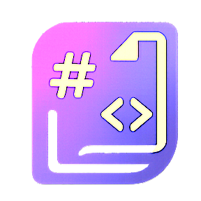
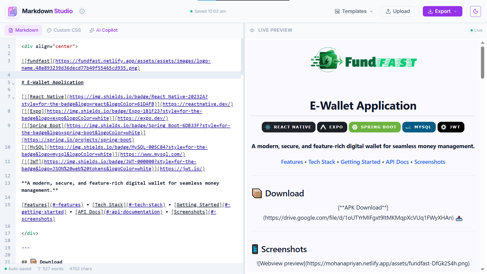
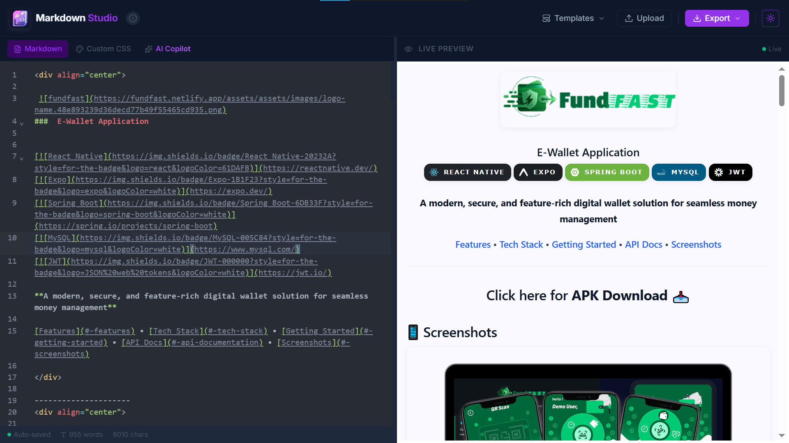
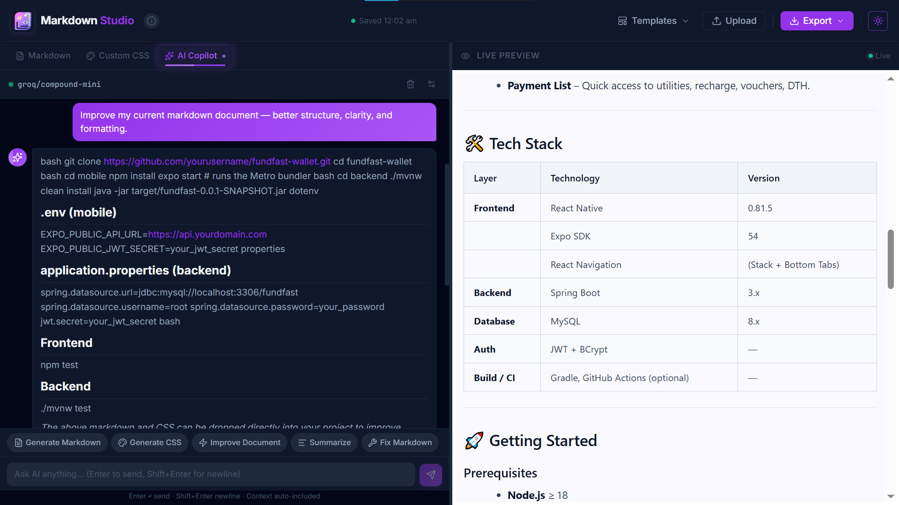
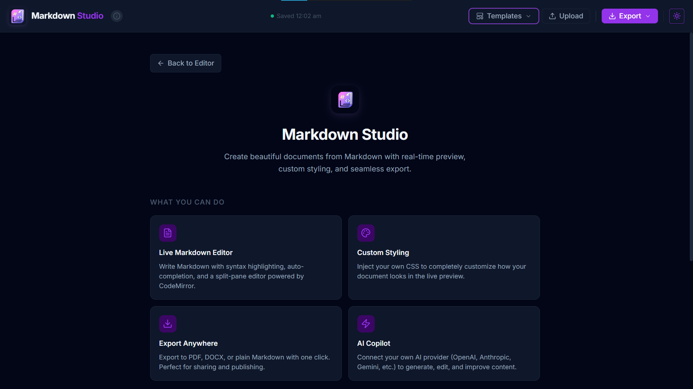
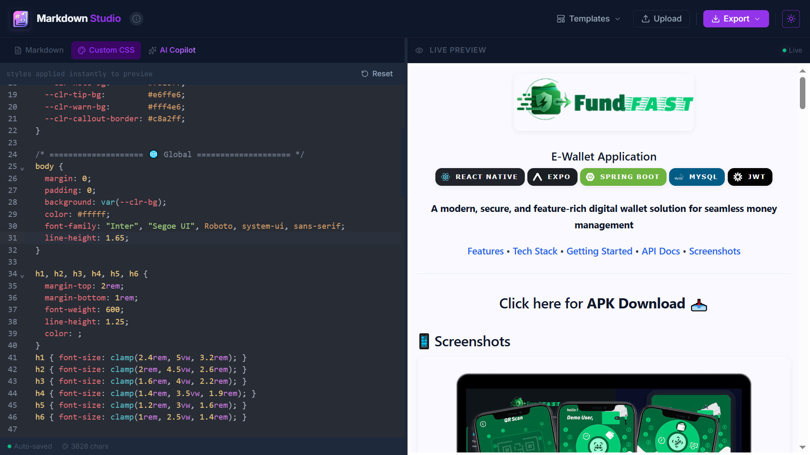

# Markdown Studio

<div align="center">



# Markdown Studio

### Write Smarter. Style Faster. Export Anywhere.

A modern AI-powered Markdown workspace for writing, formatting, and exporting beautiful documents directly from your browser.

[Live Demo](https://markdownstudio-ai.vercel.app/) •
[Features](#features) •
[Templates](#templates) •
[AI Copilot](#ai-copilot) •
[Getting Started](#getting-started)

<br/>


</div>

---

## Overview

<div align="center">


</div>

Markdown Studio is a next-generation Markdown editor that combines powerful writing tools, live document rendering, custom styling, AI-assisted content generation, and professional export capabilities into a single seamless workspace.

Whether you're creating:

* Documentation
* Technical specifications
* Project proposals
* Product requirements
* Meeting notes
* Resumes
* README files
* Knowledge base articles

Markdown Studio helps you move from idea → polished document in minutes.

---

## Features

### Real-Time Markdown Experience

* Live split-screen editor and preview
* Instant rendering while typing
* GitHub-flavored Markdown support
* Syntax highlighting
* Keyboard-first workflow
* Responsive design for desktop and mobile

### AI Copilot

<div align="center">


</div>

Generate, improve, rewrite, summarize, and expand content directly inside the editor.

Supported providers:

* OpenAI
* Anthropic Claude
* Google Gemini
* Groq
* OpenRouter
* Custom OpenAI-Compatible APIs

Capabilities:

* Content generation
* Technical writing
* Grammar improvement
* Documentation drafting
* README generation
* Content summarization
* Writing assistance

---

### Advanced Styling

<div align="center">

</div>

Transform plain Markdown into beautifully designed documents.

Features include:

* Live CSS customization
* Custom themes
* Typography controls
* Print-friendly layouts
* Branded document styling
* Professional report formatting

---

### Export Anywhere

One-click export to multiple formats:

| Format         | Supported |
| -------------- | --------- |
| Markdown (.md) | ✅         |
| PDF            | ✅         |
| DOCX           | ✅         |

Generate polished deliverables without leaving the browser.

---

### Built-In Templates

Jumpstart your writing with ready-made templates.

Available templates:

* README
* Resume
* Meeting Notes
* Technical Specification
* Product Requirement Document
* Project Proposal
* Documentation
* Blog Draft
* Research Notes

---

### Privacy First

Your content remains under your control.

* Local-first editing experience
* No mandatory account creation
* No server-side document storage
* AI requests only occur when configured by the user
* Bring your own API keys

---

## Tech Stack

### Frontend

```txt
React 19
TypeScript
Vite
CodeMirror
Tailwind CSS
Zustand
```

### AI Layer

```txt
OpenAI
Anthropic
Gemini
Groq
OpenRouter
Custom Providers
```

### Export Engine

```txt
html2pdf.js
docx
file-saver
```

---

## Architecture

```text
markdown-studio
│
├── src
│   ├── components
│   ├── editor
│   ├── preview
│   ├── templates
│   ├── ai
│   ├── export
│   ├── store
│   ├── hooks
│   ├── services
│   └── styles
│
├── public
├── docs
└── assets
```

---

## Getting Started

### Prerequisites

* Node.js 18+
* npm / pnpm / yarn

---

### Installation

Clone the repository:

```bash
git clone https://github.com/your-username/markdown-studio.git
```

Move into the project:

```bash
cd markdown-studio
```

Install dependencies:

```bash
npm install
```

Start development server:

```bash
npm run dev
```

Build for production:

```bash
npm run build
```

Preview production build:

```bash
npm run preview
```

---

## AI Configuration

Markdown Studio supports multiple AI providers.

Configure your preferred provider inside the application settings.

Optional environment variable:

```env
VITE_API_KEY=your_api_key_here
```

Without this variable, users can connect their own providers directly from the UI.

---

## Why Markdown Studio?

Most Markdown editors focus on editing.

Most AI tools focus on generating.

Markdown Studio combines both.

You get:

* Professional writing environment
* AI-powered assistance
* Custom document styling
* Multiple export formats
* Browser-based workflow
* Privacy-first architecture

All in a single workspace.

---

## Roadmap

### Current

* Markdown Editor
* Live Preview
* AI Copilot
* PDF Export
* DOCX Export
* Templates
* Custom CSS

### Planned

* Collaborative Editing
* Version History
* Cloud Sync
* Team Workspaces
* Document Sharing
* Presentation Mode
* AI Document Designer
* Template Marketplace

---

## Contributing

Contributions, ideas, and feature requests are welcome.

```bash
# Fork repository

# Create feature branch
git checkout -b feature/amazing-feature

# Commit changes
git commit -m "Add amazing feature"

# Push branch
git push origin feature/amazing-feature
```

Open a Pull Request and we'll review it.

---

## License

MIT License

---

<div align="center">

### Built for writers, developers, creators, and teams.

⭐ Star the repository if you find Markdown Studio useful.

**Markdown Studio — From Markdown to Beautiful Documents.**

</div>
